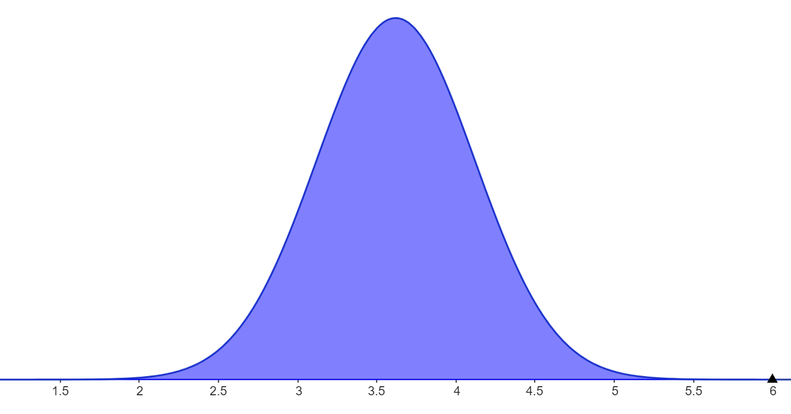

# Normalfordelingen

Vi har sett at kontinuerlige stokastiske variabler beskrives av en tetthetsfunksjon. Blant alle slike fordelinger er det én som skiller seg ut som den aller viktigste: **Normalfordelingen**.

Veldig mange fenomener i naturen og samfunnet følger denne fordelingen. Hvis du måler høyden på alle menn i Norge, vekten på epler fra et tre, eller feilmarginen på en maskin, vil resultatene ofte samle seg rundt et gjennomsnitt og tynnes ut til begge sider.

*Figur 1: Normalfordelingen med forventning μ og standardavvik σ. Grafen til normalfordelingen har en karakteristisk form som en bjelle. Derfor kalles den ofte for **bjellekurven** (Bell curve).*

## Parametre: Forventning og standardavvik

En normalfordeling er fullstendig bestemt av to tall (parametere):

1.  **Forventningsverdien ($\mu$):** Dette er sentrum av kurven. Det er gjennomsnittsverdien der toppen av "bjella" befinner seg.
2.  **Standardavviket ($\sigma$):** Dette forteller hvor bred eller smal kurven er.
    * Liten $\sigma$ $\rightarrow$ Høy og smal kurve (dataene ligger tett inntil gjennomsnittet).
    * Stor $\sigma$ $\rightarrow$ Lav og bred kurve (dataene er veldig spredte).

Matematisk ser tetthetsfunksjonen slik ut (kalt Gauss-kurven etter Carl Friedrich Gauss):

$$
f(x) = \frac{1}{\sigma \sqrt{2\pi}} e^{-\frac{1}{2}\left( \frac{x - \mu}{\sigma} \right)^2}
$$

> **Merk:** Du trenger sjelden å bruke denne formelen direkte til regning, da integralet er svært vanskelig å løse for hånd. Vi bruker i stedet digitale verktøy eller tabeller.

---

## Sannsynlighetsberegning

Akkurat som for andre kontinuerlige variabler, er sannsynligheten lik **arealet under grafen**.

Hvis en variabel $X$ er normalfordelt med forventning $\mu$ og standardavvik $\sigma$, skriver vi ofte $X \sim N(\mu, \sigma)$. Sannsynligheten for at $X$ ligger mellom $a$ og $b$ er:

$$
P(a \leq X \leq b) = \int_a^b f(x) \, dx = \text{Arealet under kurven fra } a \text{ til } b
$$

---

## Eksempel 1: Kaffemaskinen

En kaffemaskin er innstilt på å fylle kopper med 250 ml kaffe. Mengden kaffe $X$ som havner i koppen varierer litt fra gang til gang og er normalfordelt med:
* Forventningsverdi $\mu = 250$ ml
* Standardavvik $\sigma = 5$ ml

### a) Hva er sannsynligheten for at en kopp inneholder mellom 245 ml og 255 ml?

Her spør vi om sannsynligheten for at kaffemengden ligger innenfor ett standardavvik fra gjennomsnittet (fra $250-5$ til $250+5$).

Ved bruk av digitale verktøy (f.eks. GeoGebra eller Python) finner vi arealet under grafen mellom 245 og 255.

Resultatet blir:
$$
P(245 \leq X \leq 255) \approx 0,683
$$
Det er altså **68,3 %** sannsynlighet for dette.

### b) Hva er sannsynligheten for at koppen renner over (mer enn 260 ml)?

Vi skal finne $P(X > 260)$. Dette tilsvarer arealet til høyre for $x=260$.
Digital utregning gir:
$$
P(X > 260) \approx 0,023
$$
Det er altså kun **2,3 %** sannsynlighet for at vi får mer enn 260 ml.

---

## Standard normalfordeling og Z-score

For å kunne sammenligne ulike normalfordelinger, eller for å regne uten datamaskin (ved hjelp av tabeller), bruker vi **standard normalfordeling**.

Vi gjør om den stokastiske variabelen $X$ til en standardisert variabel $Z$ ved hjelp av formelen:

$$
Z = \frac{X - \mu}{\sigma}
$$

Tallet $Z$ (kalt $z$-scoren) forteller oss **hvor mange standardavvik** verdien $X$ ligger unna forventningsverdien $\mu$.

* Hvis $X = \mu$, blir $Z = 0$.
* Hvis $X$ er ett standardavvik over snittet, er $Z = 1$.

Den standardiserte variabelen $Z$ er normalfordelt med $\mu = 0$ og $\sigma = 1$.

---

## Eksempel 2: Batterilevetid (Regning med Z)

Levetiden på et batteri er normalfordelt med forventning $\mu = 40$ timer og standardavvik $\sigma = 2$ timer.
Vi vil finne sannsynligheten for at et batteri varer **mindre enn 37 timer**.

1.  **Finn Z-verdien:**
    $$
    Z = \frac{37 - 40}{2} = \frac{-3}{2} = -1,5
    $$
    Dette betyr at 37 timer ligger 1,5 standardavvik *under* gjennomsnittet.

2.  **Finn sannsynligheten:**
    Vi må finne $P(Z < -1,5)$.
    Ved å slå opp i en tabell for standard normalfordeling eller bruke kalkulator, finner vi:
    $$
    P(Z < -1,5) = 0,0668
    $$

Det er altså **6,7 %** sannsynlighet for at batteriet varer mindre enn 37 timer.

---

## "Tommelfingerreglene" (Sigma-reglene)

For alle normalfordelinger gjelder noen faste regler for hvor stor andel av dataene som faller innenfor visse grenser. Dette er svært nyttig for raskt overslag:

* **Ca. 68 %** av dataene ligger innenfor $\pm 1$ standardavvik ($\mu \pm \sigma$).
* **Ca. 95 %** av dataene ligger innenfor $\pm 2$ standardavvik ($\mu \pm 2\sigma$).
* **Ca. 99,7 %** av dataene ligger innenfor $\pm 3$ standardavvik ($\mu \pm 3\sigma$).

Dette betyr at det er ekstremt sjelden å observere verdier som ligger mer enn 3 standardavvik unna gjennomsnittet.

---

# Oppgaver

Her er noen oppgaver for å teste forståelsen din av normalfordelingen.

## Oppgave 1: Forståelse av grafen
To bedrifter, A og B, produserer spiker. Lengden på spikrene er normalfordelt hos begge. Begge bedrifter tar sikte på at spikrene skal være 50 mm lange, så $\mu = 50$ for begge.
Men, maskinene til bedrift A er mer presise enn bedrift B.
* Bedrift A har $\sigma = 0,5$ mm.
* Bedrift B har $\sigma = 2,0$ mm.

**a)** Hvis du tegner tetthetsfunksjonene til A og B i samme koordinatsystem, hvilken kurve vil være høyest på toppen?

**b)** Hvilken kurve vil være bredest?

---

## Oppgave 2: Melkekartonger
En tappemaskin fyller melk på kartonger. Mengden melk $X$ er normalfordelt med forventning $\mu = 1000$ ml (1 liter) og standardavvik $\sigma = 10$ ml.

**a)** Regn ut Z-verdien og finn sannsynligheten for at en kartong inneholder mindre enn 1025 ml.

**c)** Finn sannsynligheten for at en kartong inneholder *mindre* enn 980 ml.

---

## Oppgave 3: Opptaksprøve
På en nasjonal opptaksprøve er poengsummene normalfordelt med forventning $\mu = 500$ poeng og standardavvik $\sigma = 100$ poeng.
For å komme inn på et spesielt studium må man være blant de **16 % beste** (omtrent).

**a)** Hva er poenggrensen for å komme inn? *hint: her må vi regne baklengs fra sannsynligheten til Z-verdien*

---

# Fasit

### Oppgave 1
**a)** **Bedrift A** vil ha den høyeste kurven. Siden arealet under begge kurvene skal være 1, må kurven bli høyere når den er smalere (lavt standardavvik betyr at dataene klumper seg tett rundt midten).
**b)** **Bedrift B** vil ha den bredeste kurven, siden standardavviket er større (større spredning).

### Oppgave 2
**a)** Intervallet 980 til 1020 er fra $1000 - 2\cdot10$ til $1000 + 2\cdot10$. Altså $\mu \pm 2\sigma$. Ifølge reglene ligger ca. **95 %** av dataene her.
**b)** $Z = \frac{1025 - 1000}{10} = \frac{25}{10} = 2,5$. Sannsynligheten for å få en kartong med 1025 ml er dermed lik $P(Z < 2,5) = 0.9938 = 99,4%$.
**c)** Vi skal finne $P(X < 985)$.
Z-verdien er $Z = \frac{985 - 1000}{10} = -1,5$.
Fra oppgaveteksten (eller tabell) vet vi at $P(Z < -1,5) \approx 0,067$.
Svaret er **6,7 %**.

### Oppgave 3

**a)** Grensen er $\mu + 1\sigma = 500 + 100 = \mathbf{600}$ **poeng**.